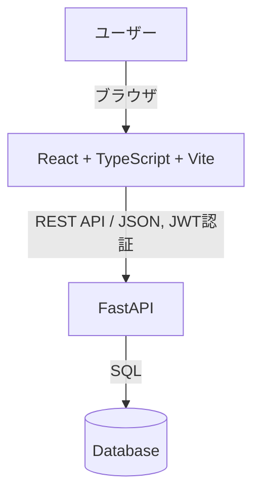
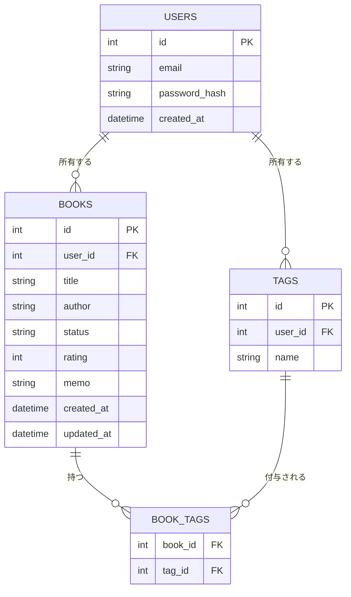
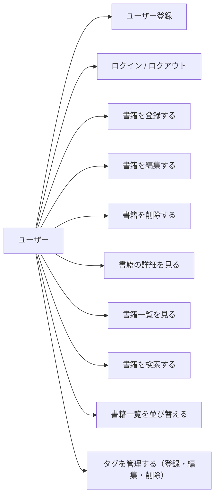
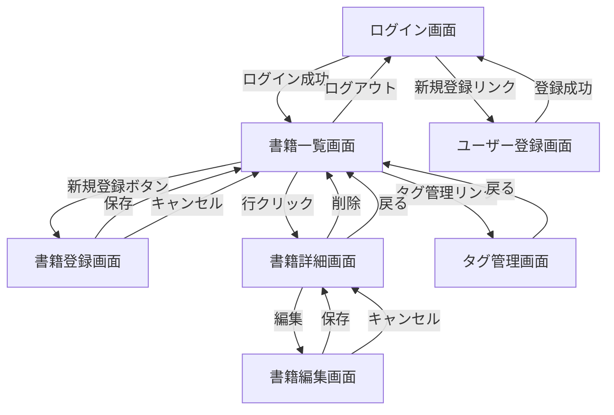

# 機能設計書

## 1. システム構成図

SPA（React）からAPIサーバー（FastAPI）へHTTP/JSON通信を行い、APIサーバーがDBへアクセスする一般的な構成とする。



- フロントエンドとバックエンドは別プロセスとして動作し、REST APIで連携する
- 認証にはJWTを使用し、ログイン後はAccess Tokenをリクエストヘッダに付与してAPIを呼び出す

## 2. データモデル定義（ER図）



### テーブル定義

#### USERS（ユーザー）
| カラム | 型 | 制約 | 説明 |
|---|---|---|---|
| id | int | PK, auto increment | ユーザーID |
| email | string | unique, not null | ログインに使用するメールアドレス |
| password_hash | string | not null | パスワードのハッシュ値 |
| created_at | datetime | not null | 作成日時 |

#### BOOKS（書籍）
| カラム | 型 | 制約 | 説明 |
|---|---|---|---|
| id | int | PK, auto increment | 書籍ID |
| user_id | int | FK(users.id), not null | 所有ユーザー |
| title | string | not null | タイトル |
| author | string | not null | 著者 |
| status | string (enum) | not null | want_to_read / unread / reading / finished |
| rating | int | nullable | 1〜5の評価。未評価はNULL |
| memo | text | nullable | メモ・感想 |
| created_at | datetime | not null | 登録日時（並び替えに使用） |
| updated_at | datetime | not null | 更新日時 |

#### TAGS（タグマスタ）
| カラム | 型 | 制約 | 説明 |
|---|---|---|---|
| id | int | PK, auto increment | タグID |
| user_id | int | FK(users.id), not null | 所有ユーザー |
| name | string | not null, unique(user_id, name) | タグ名（自由入力） |

#### BOOK_TAGS（書籍-タグ 中間テーブル）
| カラム | 型 | 制約 | 説明 |
|---|---|---|---|
| book_id | int | FK(books.id), not null | 書籍ID |
| tag_id | int | FK(tags.id), not null | タグID |

- タグはユーザーごとにマスタ管理し、複数の書籍に同じタグを付与できる（多対多）
- 同じユーザー内でタグ名は一意（既存タグの選択 or 新規タグの作成のいずれかを書籍登録・編集時に行う）
- タグの編集（リネーム）・削除はタグ管理画面から行う。削除した場合は `BOOK_TAGS` の関連レコードも削除される（紐づく書籍からタグが外れる）

### ステータスの値
| 値（システム上） | 表示名 |
|---|---|
| want_to_read | 読みたい |
| unread | 未読 |
| reading | 読書中 |
| finished | 読了 |

## 3. ユースケース図



## 4. 画面遷移図



## 5. ワイヤーフレーム

### 5.1 ログイン画面
```
┌─────────────────────────────┐
│         Book Shelf           │
│                               │
│   Email    [______________]  │
│   Password [______________]  │
│                               │
│         [ ログイン ]          │
│                               │
│   新規登録はこちら             │
└─────────────────────────────┘
```

### 5.2 書籍一覧画面
```
┌──────────────────────────────────────────────────────────┐
│ Book Shelf                                  [ログアウト]    │
├──────────────────────────────────────────────────────────┤
│ [検索: タイトル・著者______] [検索]      [+ 新規登録]        │
├──────────────────────────────────────────────────────────┤
│ タイトル▲ │ 著者 │ ステータス │ 評価 │ タグ      │ メモ      │
├──────────────────────────────────────────────────────────┤
│ ○○○○     │ △△  │ 読書中     │ ★★★★ │ SF, 名作   │ 面白い... │
│ □□□□     │ ▽▽  │ 読みたい   │ -    │ 技術書     │           │
│ ...                                                         │
├──────────────────────────────────────────────────────────┤
│              [< 前へ]  1 / 5 ページ  [次へ >]                │
└──────────────────────────────────────────────────────────┘
```
- 列見出し（タイトル・著者・登録日・評価）クリックで並び替え（昇順/降順切り替え）
- 行クリックで詳細画面へ遷移

### 5.3 書籍登録・編集画面
```
┌─────────────────────────────────┐
│ 書籍登録 / 編集                   │
├─────────────────────────────────┤
│ タイトル *  [____________________]│
│ 著者     *  [____________________]│
│ ステータス * [読みたい ▼]          │
│ 評価        [未評価 ▼] (1-5)      │
│ タグ        [____________________]│
│              (入力でサジェスト表示、│
│               Enterで追加、複数可)  │
│              選択済み: [SF x][名作 x]│
│ メモ        [____________________]│
│              [____________________]│
│                                   │
│        [保存]      [キャンセル]    │
└─────────────────────────────────┘
```

### 5.4 書籍詳細画面
```
┌─────────────────────────────────┐
│ ○○○○○○                          │
├─────────────────────────────────┤
│ 著者: △△△△                       │
│ ステータス: 読書中                 │
│ 評価: ★★★★☆                      │
│ タグ: SF, 名作                     │
│ メモ:                             │
│   面白かった。続編も読みたい。      │
│ 登録日: 2026-05-01                 │
├─────────────────────────────────┤
│        [編集]      [削除]          │
│             [一覧へ戻る]           │
└─────────────────────────────────┘
```

### 5.5 タグ管理画面
```
┌─────────────────────────────────┐
│ タグ管理                          │
├─────────────────────────────────┤
│ 新規タグ [______________] [追加]  │
├─────────────────────────────────┤
│ SF          [編集] [削除]          │
│ 名作        [編集] [削除]          │
│ 技術書      [編集] [削除]          │
│ ...                               │
├─────────────────────────────────┤
│             [一覧へ戻る]           │
└─────────────────────────────────┘
```
- 編集ボタンでタグ名をインライン編集可能にする
- 削除時は確認ダイアログを表示し、削除すると紐づく書籍からもタグが外れる旨を明示する

## 6. コンポーネント設計（フロントエンド）

```
src/
├── pages/
│   ├── LoginPage
│   ├── RegisterPage
│   ├── BookListPage
│   ├── BookCreatePage
│   ├── BookEditPage
│   ├── BookDetailPage
│   └── TagManagePage
├── components/
│   ├── layout/
│   │   └── Header（ナビゲーション・ログアウト）
│   ├── book/
│   │   ├── BookTable（一覧表）
│   │   ├── BookForm（登録・編集共通フォーム）
│   │   ├── StatusBadge（ステータス表示）
│   │   ├── RatingStars（評価表示・入力）
│   │   └── TagInput（タグ入力・サジェスト・選択表示）
│   └── common/
│       ├── SearchBox
│       ├── Pagination
│       └── SortableHeader
├── hooks/
│   ├── useAuth（認証状態管理）
│   ├── useBooks（書籍データ取得・操作）
│   └── useTags（タグ一覧取得）
├── api/
│   ├── client（APIクライアント, JWT付与）
│   ├── authApi
│   ├── booksApi
│   └── tagsApi
└── types/
    ├── book.ts
    ├── tag.ts
    └── user.ts
```

- 認証状態は `useAuth` で管理し、未ログイン時は各ページから `LoginPage` へリダイレクトする
- 書籍一覧の検索・並び替え・ページネーションはURLクエリパラメータと連動させ、リロード時も状態を保持する

## 7. API設計

ベースパス: `/api`

### 7.1 認証

| メソッド | パス | 説明 | 認証 |
|---|---|---|---|
| POST | /api/auth/register | ユーザー登録 | 不要 |
| POST | /api/auth/login | ログイン（JWT発行） | 不要 |

#### POST /api/auth/register
- リクエスト: `{ "email": string, "password": string }`
- レスポンス: `201 Created` `{ "id": number, "email": string }`

#### POST /api/auth/login
- リクエスト: `{ "email": string, "password": string }`
- レスポンス: `200 OK` `{ "access_token": string, "token_type": "bearer" }`

### 7.2 タグ

| メソッド | パス | 説明 | 認証 |
|---|---|---|---|
| GET | /api/tags | タグ一覧取得（自分のタグマスタ） | 必要 |
| POST | /api/tags | タグ新規登録 | 必要 |
| PUT | /api/tags/{id} | タグ名の編集（リネーム） | 必要 |
| DELETE | /api/tags/{id} | タグ削除 | 必要 |

#### GET /api/tags
- レスポンス: `200 OK` `{ "items": [ { "id": 1, "name": "SF" }, { "id": 2, "name": "名作" } ] }`
- 書籍登録・編集画面でのタグ選択・サジェスト、タグ管理画面の一覧表示に使用する
- 書籍登録・編集時に存在しないタグ名を指定した場合は、新規タグとしてタグマスタに自動登録する

#### POST /api/tags
- リクエスト: `{ "name": string }`
- レスポンス: `201 Created` `{ "id": number, "name": string }`
- 同一ユーザー内でタグ名が重複する場合は `409 Conflict`

#### PUT /api/tags/{id}
- リクエスト: `{ "name": string }`
- レスポンス: `200 OK` `{ "id": number, "name": string }`
- 同一ユーザー内でタグ名が重複する場合は `409 Conflict`

#### DELETE /api/tags/{id}
- レスポンス: `204 No Content`
- 削除すると `BOOK_TAGS` の関連レコードも削除され、紐づく書籍からタグが外れる

#### 認証エラー
- 未認証または他ユーザーのタグへのアクセス: `401 Unauthorized` / `404 Not Found`（自分のものでないIDは404として扱い、存在を秘匿する）

### 7.3 書籍

| メソッド | パス | 説明 | 認証 |
|---|---|---|---|
| GET | /api/books | 書籍一覧取得（検索・並び替え・ページネーション） | 必要 |
| POST | /api/books | 書籍登録 | 必要 |
| GET | /api/books/{id} | 書籍詳細取得 | 必要 |
| PUT | /api/books/{id} | 書籍更新 | 必要 |
| DELETE | /api/books/{id} | 書籍削除（`204 No Content`） | 必要 |

#### GET /api/books
クエリパラメータ:
| パラメータ | 型 | 説明 |
|---|---|---|
| q | string | タイトル・著者へのフリーテキスト検索 |
| sort | string | `title` / `author` / `created_at` / `rating` |
| order | string | `asc` / `desc`（デフォルト: `asc`） |
| page | int | ページ番号（デフォルト: 1） |
| page_size | int | 1ページあたりの件数（デフォルト: 20） |

レスポンス:
```json
{
  "items": [
    {
      "id": 1,
      "title": "string",
      "author": "string",
      "status": "reading",
      "rating": 4,
      "tags": ["SF", "名作"],
      "memo": "string",
      "created_at": "2026-05-01T00:00:00Z",
      "updated_at": "2026-05-01T00:00:00Z"
    }
  ],
  "total": 100,
  "page": 1,
  "page_size": 20
}
```

#### POST /api/books / PUT /api/books/{id}
リクエスト:
```json
{
  "title": "string",
  "author": "string",
  "status": "want_to_read",
  "rating": null,
  "tags": ["SF", "名作"],
  "memo": "string"
}
```
- `title`, `author`, `status` は必須
- `rating` は1〜5またはnull
- `tags` は文字列配列（空配列可）

#### 認証エラー
- 未認証または他ユーザーの書籍へのアクセス: `401 Unauthorized` / `404 Not Found`（自分のものでないIDは404として扱い、存在を秘匿する）
